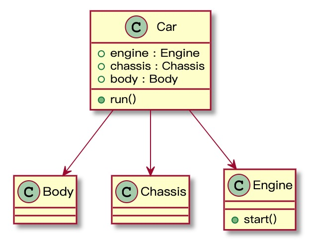
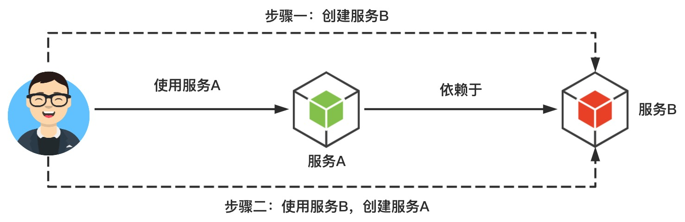
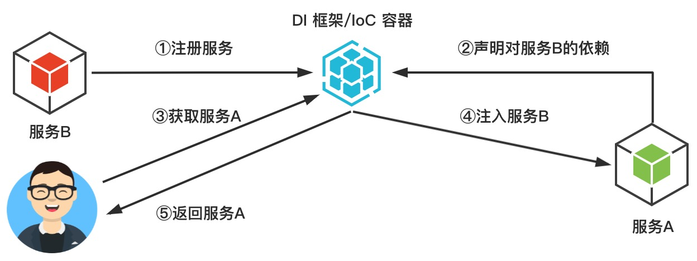
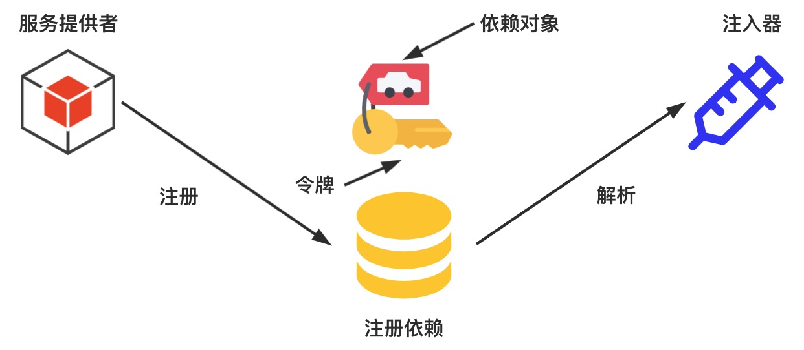
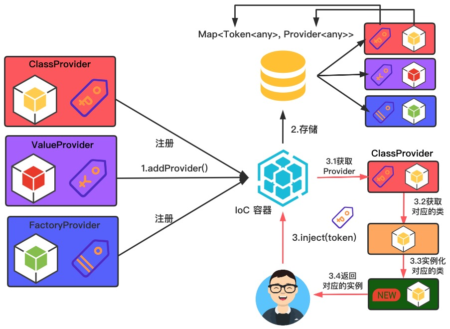
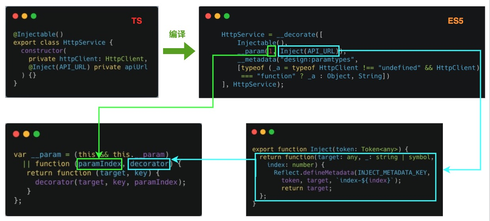
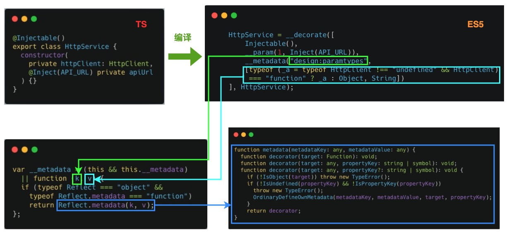

## 了不起的 IoC 与 DI

> 该项目包含本文最终实现 IoC 容器的源代码，本文将一步步介绍如何使用 TypeScript 实现一个 IoC 容器。

本文阿宝哥将从六个方面入手，全方位带你一起探索面向对象编程中 **IoC（控制反转）和 DI（依赖注入）** 的设计思想。阅读完本文，你将了解以下内容：

- IoC 是什么、IoC 能解决什么问题；
- IoC 与 DI 之间的关系、未使用 DI 框架和使用 DI 框架之间的区别；
- DI 在 AngularJS/Angular 和 NestJS 中的应用；
- 了解如何使用 TypeScript 实现一个 IoC 容器，并了解 **装饰器、反射** 的相关知识。

### 一、背景概述

在介绍什么是 IoC 容器之前，阿宝哥来举一个日常工作中很常见的场景，即创建指定类的实例。最简单的情形是该类没有依赖其他类，但现实往往是残酷的，我们在创建某个类的实例时，需要依赖不同类对应的实例。为了让小伙伴们能够更好地理解上述的内容，阿宝哥来举一个例子。

一辆小汽车 🚗 通常由 **发动机、底盘、车身和电气设备** 四大部分组成。汽车电气设备的内部构造很复杂，简单起见，我们只考虑三个部分：发动机、底盘和车身。


（图片来源：https://www.newkidscar.com/vehicle-construction/car-structure/）

在现实生活中，要造辆车还是很困难的。而在软件的世界中，这可难不倒我们。👇是阿宝哥要造的车子，有木有很酷。


（图片来源：https://pixabay.com/zh/illustrations/car-sports-car-racing-car-speed-49278/）

在开始造车前，我们得先看一下 “图纸”：



看完上面的 “图纸”，我们马上来开启造车之旅。第一步我们先来定义车身类：

**1.定义车身类**

```typescript
export default class Body { }
```

**2.定义底盘类**

```typescript
export default class Chassis { }
```

**3.定义引擎类**

```typescript
export default class Engine {
  start() {
    console.log("引擎发动了");
  }
}
```

**4.定义汽车类**

```typescript
import Engine from './engine';
import Chassis from './chassis';
import Body from './body';

export default class Car {
    engine: Engine;
    chassis: Chassis;
    body: Body;

    constructor() {
      this.engine = new Engine();
      this.body = new Body();
      this.chassis = new Chassis();
    }

    run() {
      this.engine.start();
    }
}
```

一切已准备就绪，我们马上来造一辆车：

```typescript
const car = new Car(); // 阿宝哥造辆新车
car.run(); // 控制台输出：引擎发动了
```

现在虽然车已经可以启动了，但却存在以下问题：

- 问题一：在造车的时候，你不能选择配置。比如你想更换汽车引擎的话，按照目前的方案，是实现不了的。
- 问题二：在汽车类内部，你需要在构造函数中手动去创建汽车的各个部件。

为了解决第一个问题，提供更灵活的方案，我们可以重构一下已定义的汽车类，具体如下：

```typescript
export default class Car {
    body: Body;
    engine: Engine;
    chassis: Chassis;
  
    constructor(engine, body, chassis) {
      this.engine = engine;
      this.body = body;
      this.chassis = chassis;
    }

    run() {
      this.engine.start();
    }
}
```

重构完汽车类，我们来重新造辆新车：

```typescript
const engine = new NewEngine();
const body = new Body();
const chassis = new Chassis();

const newCar = new Car(engine, body, chassis);
newCar.run();
```

此时我们已经解决了上面提到的第一个问题，要解决第二个问题我们要来了解一下 IoC（控制反转）的概念。

### 二、IoC 是什么

IoC（Inversion of Control），即 “控制反转”。在开发中， IoC 意味着你设计好的对象交给容器控制，而不是使用传统的方式，在对象内部直接控制。　　

如何理解好 IoC 呢？理解好 IoC 的关键是要明确 **“谁控制谁，控制什么，为何是反转，哪些方面反转了”**，我们来深入分析一下。　　

- 谁控制谁，控制什么：在传统的程序设计中，我们直接在对象内部通过 `new` 的方式创建对象，是程序主动创建依赖对象； **而 IoC 是有专门一个容器来创建这些对象，即由 IoC 容器控制对象的创建**；

  谁控制谁？当然是 IoC 容器控制了对象；控制什么？主要是控制外部资源（依赖对象）获取。

- 为何是反转了，哪些方面反转了：有反转就有正转，传统应用程序是由我们自己在程序中主动控制去获取依赖对象，也就是正转； **而反转则是由容器来帮忙创建及注入依赖对象**；

  为何是反转？因为由容器帮我们查找及注入依赖对象，对象只是被动的接受依赖对象，所以是反转了；哪些方面反转了？依赖对象的获取被反转了。

### 三、IoC 能做什么

IoC 不是一种技术，只是一种思想，是面向对象编程中的一种设计原则，可以用来减低计算机代码之间的耦合度。

传统应用程序都是由我们在类内部主动创建依赖对象，从而导致类与类之间高耦合，难于测试； **有了 IoC 容器后，把创建和查找依赖对象的控制权交给了容器，由容器注入组合对象，所以对象之间是松散耦合。** 这样也便于测试，利于功能复用，更重要的是使得程序的整个体系结构变得非常灵活。　　

其实 IoC 对编程带来的最大改变不是从代码上，而是思想上，发生了 “主从换位” 的变化。应用程序本来是老大，要获取什么资源都是主动出击，但在 IoC 思想中，应用程序就变成被动了，被动的等待 IoC 容器来创建并注入它所需的资源了。　　　　

### 四、IoC 与 DI 之间的关系

对于控制反转来说，其中最常见的方式叫做 **依赖注入**，简称为 DI（Dependency Injection）。

组件之间的依赖关系由容器在运行期决定，形象的说，即由容器动态的将某个依赖关系注入到组件之中。 **依赖注入的目的并非为软件系统带来更多功能，而是为了提升组件重用的频率，并为系统搭建一个灵活、可扩展的平台。** 

通过依赖注入机制，我们只需要通过简单的配置，而无需任何代码就可指定目标需要的资源，完成自身的业务逻辑，而不需要关心具体的资源来自何处，由谁实现。

理解 DI 的关键是 **“谁依赖了谁，为什么需要依赖，谁注入了谁，注入了什么”**：　

- 谁依赖了谁：当然是应用程序依赖 IoC 容器；
- 为什么需要依赖：应用程序需要 IoC 容器来提供对象需要的外部资源（包括对象、资源、常量数据）；
- 谁注入谁：很明显是 IoC 容器注入应用程序依赖的对象；
- 注入了什么：注入某个对象所需的外部资源（包括对象、资源、常量数据）。

那么 IoC 和 DI 有什么关系？其实它们是同一个概念的不同角度描述，由于控制反转的概念比较含糊（可能只是理解为容器控制对象这一个层面，很难让人想到谁来维护依赖关系），所以 2004 年大师级人物 Martin Fowler 又给出了一个新的名字：**“依赖注入”，相对 IoC 而言，“依赖注入” 明确描述了被注入对象依赖 IoC 容器配置依赖对象**。

总的来说， 控制反转（Inversion of Control）是说创建对象的控制权发生转移，以前创建对象的主动权和创建时机由应用程序把控，而现在这种权利转交给 IoC 容器，它就是一个专门用来创建对象的工厂，你需要什么对象，它就给你什么对象。 **有了 IoC 容器，依赖关系就改变了，原先的依赖关系就没了，它们都依赖 IoC 容器了，通过 IoC 容器来建立它们之间的关系**。　

前面介绍了那么多的概念，现在我们来看一下未使用依赖注入框架和使用依赖注入框架之间有什么明显的区别。

#### 4.1 未使用依赖注入框架

假设我们的服务 A 依赖于服务 B，即要使用服务 A 前，我们需要先创建服务 B。具体的流程如下图所示：



从上图可知，未使用依赖注入框架时，服务的使用者需要关心服务本身和其依赖的对象是如何创建的，且需要手动维护依赖关系。若服务本身需要依赖多个对象，这样就会增加使用难度和后期的维护成本。对于上述的问题，我们可以考虑引入依赖注入框架。下面我们来看一下引入依赖注入框架，整体流程会发生什么变化。

#### 4.2 使用依赖注入框架

使用依赖注入框架之后，系统中的服务会统一注册到 IoC 容器中，如果服务有依赖其他服务时，也需要对依赖进行声明。当用户需要使用特定的服务时，IoC 容器会负责该服务及其依赖对象的创建与管理工作。具体的流程如下图所示：



到这里我们已经介绍了 IoC 与 DI 的概念及特点，接下来我们来介绍 DI 的应用。

### 五、DI 的应用

DI 在前端和服务端都有相应的应用，比如在前端领域的代表是 [AngularJS](https://angularjs.org/) 和 [Angular](https://angular.io/)，而在服务端领域是 [Node.js](https://nodejs.org/zh-cn/) 生态中比较出名的 [NestJS](https://nestjs.com/)。接下来阿宝哥将简单介绍一下 DI 在 AngularJS/Angular 和 NestJS 中的应用。

#### 5.1 DI 在 AngularJS 中的应用

在 AngularJS 中，依赖注入是其核心的特性之一。在 AngularJS 中声明依赖项有 3 种方式：

```javascript
// 方式一：　使用 $inject annotation 方式
let fn = function (a, b) {};
fn.$inject = ['a', 'b'];

// 方式二：　使用 array-style annotations 方式
let fn = ['a', 'b', function (a, b) {}];

// 方式三：　使用隐式声明方式　
let fn = function (a, b) {}; // 不推荐
```

对于以上的代码，相信使用过 AngularJS 的小伙们都不会陌生。作为 AngularJS 核心功能特性的 DI 还是蛮强大的，但随着 AngularJS 的普及和应用的复杂度不断提高，AngularJS DI 系统的问题就暴露出来了。

这里阿宝哥简单介绍一下 AngularJS DI 系统存在的几个问题：

- 内部缓存： AngularJS 应用程序中所有的依赖项都是单例，我们不能控制是否使用新的实例；
- 命名空间冲突： 在系统中我们使用字符串来标识服务的名称，假设我们在项目中已有一个 CarService，然而第三方库中也引入了同样的服务，这样的话就容易出现混淆。

由于 AngularJS DI 存在以上的问题，所以在后续的 Angular 重新设计了新的 DI 系统。

#### 5.2 DI 在 Angular 中的应用

以前面汽车的例子为例，我们可以把汽车、发动机、底盘和车身这些认为是一种 “服务”，所以它们会以服务提供者的形式注册到 DI 系统中。为了能区分不同服务，我们需要使用不同的令牌（Token）来标识它们。接着我们会基于已注册的服务提供者创建注入器对象。

之后，当我们需要获取指定服务时，我们就可以通过该服务对应的令牌，从注入器对象中获取令牌对应的依赖对象。上述的流程的具体如下图所示：



好的，了解完上述的流程。下面我们来看一下如何使用 Angular 内置的 DI 系统来 “造车”。

##### 5.2.1 car.ts

```typescript
// car.ts
import { Injectable, ReflectiveInjector } from '@angular/core';

// 配置Provider
@Injectable({
  providedIn: 'root',
})
export class Body {}

@Injectable({
  providedIn: 'root',
})
export class Chassis {}

@Injectable({
  providedIn: 'root',
})
export class Engine {
  start() {
    console.log('引擎发动了');
  }
}

@Injectable()
export default class Car {
  // 使用构造注入方式注入依赖对象
  constructor(
    private engine: Engine,
    private body: Body,
    private chassis: Chassis
  ) {}

  run() {
    this.engine.start();
  }
}

const injector = ReflectiveInjector.resolveAndCreate([
  Car,
  Engine,
  Chassis,
  Body,
]);

const car = injector.get(Car);
car.run();
```

在以上代码中我们调用 ReflectiveInjector 对象的 `resolveAndCreate` 方法手动创建注入器，然后根据车辆对应的 `Token` 来获取对应的依赖对象。通过观察上述代码，你可以发现，我们已经不需要手动地管理和维护依赖对象了，这些 “脏活”、“累活” 已经交给注入器来处理了。

此外，如果要能正常获取汽车对象，我们还需要在 `app.module.ts` 文件中声明 Car 对应 Provider，具体如下所示：

##### 5.2.2 app.module.ts

```typescript
import { BrowserModule } from '@angular/platform-browser';
import { NgModule } from '@angular/core';

import { AppComponent } from './app.component';
import Car, { Body, Chassis, Engine } from './car';

@NgModule({
  declarations: [AppComponent],
  imports: [BrowserModule],
  providers: [{ provide: Car, deps: [Engine, Body, Chassis] }],
  bootstrap: [AppComponent],
})
export class AppModule {}
```

#### 5.3 DI 在 NestJS 中的应用

[NestJS](https://nestjs.com/) 是构建高效，可扩展的 [Node.js](http://nodejs.cn/) Web 应用程序的框架。 它使用现代的 JavaScript 或 [TypeScript](https://www.tslang.cn/)（保留与纯 JavaScript 的兼容性），并结合 OOP（面向对象编程），FP（函数式编程）和FRP（函数响应式编程）的元素。

在底层，Nest 使用了 [Express](http://www.expressjs.com.cn/)，但也提供了与其他各种库的兼容，例如 [Fastify](https://github.com/fastify/fastify)，可以方便地使用各种可用的第三方插件。

近几年，由于 Node.js，JavaScript 已经成为 Web 前端和后端应用程序的「通用语言」，从而产生了像 [Angular](https://angular.cn/)、[React](https://github.com/facebook/react)、[Vue](https://github.com/vuejs/vue) 等令人耳目一新的项目，这些项目提高了开发人员的生产力，使得可以快速构建可测试的且可扩展的前端应用程序。 然而，在服务器端，虽然有很多优秀的库、helper 和 Node 工具，但是它们都没有有效地解决主要问题 —— 架构。

**NestJS 旨在提供一个开箱即用的应用程序体系结构，允许轻松创建高度可测试，可扩展，松散耦合且易于维护的应用程序。** 在 NestJS 中也为我们开发者提供了依赖注入的功能，这里我们以[官网](https://nestjs.com/)的示例来演示一下依赖注入的功能。

##### 5.3.1 app.service.ts

```typescript
import { Injectable } from '@nestjs/common';

@Injectable()
export class AppService {
  getHello(): string {
    return 'Hello World!';
  }
}
```

##### 5.3.2 app.controller.ts

```typescript
import { Get, Controller, Render } from '@nestjs/common';
import { AppService } from './app.service';

@Controller()
export class AppController {
  constructor(private readonly appService: AppService) {}

  @Get()
  @Render('index')
  render() {
    const message = this.appService.getHello();
    return { message };
  }
}
```

在 AppController 中，我们通过构造注入的方式注入了 AppService 对象，当用户访问首页的时候，我们会调用 AppService 对象的 `getHello` 方法来获取 `'Hello World!'` 消息，并把消息返回给用户。当然为了保证依赖注入可以正常工作，我们还需要在 AppModule 中声明 providers 和 controllers，具体操作如下：

```typescript
import { Module } from '@nestjs/common';
import { AppController } from './app.controller';
import { AppService } from './app.service';

@Module({
  imports: [],
  controllers: [AppController],
  providers: [AppService],
})
export class AppModule {}
```

其实 DI 并不是 AngularJS/Angular 和 NestJS 所特有的，如果你想在其他项目中使用 DI/IoC 的功能特性，阿宝哥推荐你使用 [InversifyJS](http://inversify.io/)，它是一个可用于 JavaScript 和 Node.js 应用，功能强大、轻量的 IoC 容器。

对 [InversifyJS](http://inversify.io/) 感兴趣的小伙伴可以自行了解一下，阿宝哥就不继续展开介绍了。接下来，我们将进入本文的重点，即介绍如何使用 TypeScript 实现一个简单的 IoC 容器，该容器实现的功能如下图所示：



### 六、手写 IoC 容器

为了让大家能更好地理解 IoC 容器的实现代码，阿宝哥来介绍一些相关的前置知识。

#### 6.1 装饰器

如果你有使用过 Angular 或 NestJS，相信你对以下的代码不会陌生。

```typescript
@Injectable()
export class HttpService {
  constructor(
    private httpClient: HttpClient
  ) {}
}
```

在以上代码中，我们使用了 `Injectable` 装饰器。该装饰器用于表示此类可以自动注入其依赖项。其中 `@Injectable()` 中的 `@` 符号属于语法糖。

装饰器是一个包装类，函数或方法并为其添加行为的函数。这对于定义与对象关联的元数据很有用。装饰器有以下四种分类：

- 类装饰器（Class decorators）
- 属性装饰器（Property decorators）
- 方法装饰器（Method decorators）
- 参数装饰器（Parameter decorators）

前面示例中使用的 `@Injectable()` 装饰器，属于类装饰器。在该类装饰器修饰的 `HttpService` 类中，我们通过构造注入的方式注入了用于处理 HTTP 请求的 `HttpClient` 依赖对象。

#### 6.2 反射

```typescript
@Injectable()
export class HttpService {
  constructor(
    private httpClient: HttpClient
  ) {}
}
```

以上代码若设置编译的目标为 ES5，则会生成以下代码：

```typescript
// 忽略__decorate函数等代码
var __metadata = (this && this.__metadata) || function (k, v) {
    if (typeof Reflect === "object" && typeof Reflect.metadata === "function") 
      return Reflect.metadata(k, v);
};

var HttpService = /** @class */ (function () {
    function HttpService(httpClient) {
      this.httpClient = httpClient;
    }
    var _a;
    HttpService = __decorate([
        Injectable(),
        __metadata("design:paramtypes", [typeof (_a = typeof HttpClient !== "undefined" && HttpClient)
           === "function" ? _a : Object])
    ], HttpService);
    return HttpService;
}());
```

通过观察上述代码，你会发现 `HttpService` 构造函数中 `httpClient` 参数的类型被擦除了，这是因为 JavaScript 是弱类型语言。那么如何在运行时，保证注入正确类型的依赖对象呢？这里 TypeScript 使用 [reflect-metadata](https://www.npmjs.com/package/reflect-metadata) 这个第三方库来存储额外的类型信息。

 [reflect-metadata](https://www.npmjs.com/package/reflect-metadata) 这个库提供了很多 API 用于操作元信息，这里我们只简单介绍几个常用的 API：

```typescript
// define metadata on an object or property
Reflect.defineMetadata(metadataKey, metadataValue, target);
Reflect.defineMetadata(metadataKey, metadataValue, target, propertyKey);

// check for presence of a metadata key on the prototype chain of an object or property
let result = Reflect.hasMetadata(metadataKey, target);
let result = Reflect.hasMetadata(metadataKey, target, propertyKey);

// get metadata value of a metadata key on the prototype chain of an object or property
let result = Reflect.getMetadata(metadataKey, target);
let result = Reflect.getMetadata(metadataKey, target, propertyKey);

// delete metadata from an object or property
let result = Reflect.deleteMetadata(metadataKey, target);
let result = Reflect.deleteMetadata(metadataKey, target, propertyKey);

// apply metadata via a decorator to a constructor
@Reflect.metadata(metadataKey, metadataValue)
class C {
  // apply metadata via a decorator to a method (property)
  @Reflect.metadata(metadataKey, metadataValue)
  method() {
  }
}
```

对于上述的 API 只需简单了解一下即可。在后续的内容中，我们将介绍具体如何使用。这里我们需要注意以下两个问题：

- 对于类或函数，我们需要使用装饰器来修饰它们，这样才能保存元数据。
- 只有类、枚举或原始数据类型能被记录。接口和联合类型作为 “对象” 出现。这是因为这些类型在编译后完全消失，而类却一直存在。

#### 6.3 定义 Token 和 Provider

了解完装饰器与反射相关的基础知识，接下来我们来开始实现 IoC 容器。我们的 IoC 容器将使用两个主要的概念：令牌（Token）和提供者（Provider）。令牌是 IoC 容器所要创建对象的标识符，而提供者用于描述如何创建这些对象。

IoC 容器最小的公共接口如下所示：

```typescript
export class Container {
  addProvider<T>(provider: Provider<T>) {} // TODO
  inject<T>(type: Token<T>): T {} // TODO
}
```

接下来我们先来定义 Token：

```typescript
// type.ts
interface Type<T> extends Function {
  new (...args: any[]): T;
}

// provider.ts
class InjectionToken {
  constructor(public injectionIdentifier: string) {}
}

type Token<T> = Type<T> | InjectionToken;
```

Token 类型是一个联合类型，既可以是一个函数类型也可以是 InjectionToken 类型。AngularJS 中使用字符串作为 Token，在某些情况下，可能会导致冲突。因此，为了解决这个问题，我们定义了 InjectionToken 类，来避免出现命名冲突问题。

定义完 Token 类型，接下来我们来定义三种不同类型的 Provider：

- ClassProvider：提供一个类，用于创建依赖对象；
- ValueProvider：提供一个已存在的值，作为依赖对象；
- FactoryProvider：提供一个工厂方法，用于创建依赖对象。

```typescript
// provider.ts
export type Factory<T> = () => T;

export interface BaseProvider<T> {
  provide: Token<T>;
}

export interface ClassProvider<T> extends BaseProvider<T> {
  provide: Token<T>;
  useClass: Type<T>;
}

export interface ValueProvider<T> extends BaseProvider<T> {
  provide: Token<T>;
  useValue: T;
}

export interface FactoryProvider<T> extends BaseProvider<T> {
  provide: Token<T>;
  useFactory: Factory<T>;
}

export type Provider<T> =
  | ClassProvider<T>
  | ValueProvider<T>
  | FactoryProvider<T>;
```

为了更方便的区分这三种不同类型的 Provider，我们自定义了三个类型守卫函数：

```typescript
// provider.ts
export function isClassProvider<T>(
  provider: BaseProvider<T>
): provider is ClassProvider<T> {
  return (provider as any).useClass !== undefined;
}

export function isValueProvider<T>(
  provider: BaseProvider<T>
): provider is ValueProvider<T> {
  return (provider as any).useValue !== undefined;
}

export function isFactoryProvider<T>(
  provider: BaseProvider<T>
): provider is FactoryProvider<T> {
  return (provider as any).useFactory !== undefined;
}
```

#### 6.4 定义装饰器

在前面我们已经提过了，对于类或函数，我们需要使用装饰器来修饰它们，这样才能保存元数据。因此，接下来我们来分别创建 **Injectable** 和 **Inject** 装饰器。

##### 6.4.1 Injectable 装饰器

Injectable 装饰器用于表示此类可以自动注入其依赖项，该装饰器属于类装饰器。在 TypeScript 中，类装饰器的声明如下：

```typescript
declare type ClassDecorator = <TFunction extends Function>(target: TFunction) 
  => TFunction | void;
```

类装饰器顾名思义，就是用来装饰类的。它接收一个参数：`target: TFunction`，表示被装饰的类。下面我们来看一下 Injectable 装饰器的具体实现：

```typescript
// Injectable.ts
import { Type } from "./type";
import "reflect-metadata";

const INJECTABLE_METADATA_KEY = Symbol("INJECTABLE_KEY");

export function Injectable() {
  return function(target: any) {
    Reflect.defineMetadata(INJECTABLE_METADATA_KEY, true, target);
    return target;
  };
}
```

在以上代码中，当调用完 Injectable 函数之后，会返回一个新的函数。在新的函数中，我们使用 [reflect-metadata](https://www.npmjs.com/package/reflect-metadata)  这个库提供的 defineMetadata API 来保存元信息，其中 defineMetadata API 的使用方式如下所示：

```typescript
// define metadata on an object or property
Reflect.defineMetadata(metadataKey, metadataValue, target);
Reflect.defineMetadata(metadataKey, metadataValue, target, propertyKey);
```

Injectable 类装饰器使用方式也简单，只需要在被装饰类的上方使用 `@Injectable()` 语法糖就可以应用该装饰器：

```typescript
@Injectable()
export class HttpService {
  constructor(
    private httpClient: HttpClient
  ) {}
}
```

在以上示例中，我们注入的是 Type 类型的 HttpClient 对象。但在实际的项目中，往往会比较复杂。除了需要注入 Type 类型的依赖对象之外，我们还可能会注入其他类型的依赖对象，比如我们希望在 HttpService 服务中注入远程服务器的 API 地址。针对这种情形，我们需要使用 Inject 装饰器。

##### 6.4.2 Inject 装饰器

接下来我们来创建 Inject 装饰器，该装饰器属于参数装饰器。在 TypeScript 中，参数装饰器的声明如下：

```typescript
declare type ParameterDecorator = (target: Object, 
  propertyKey: string | symbol, parameterIndex: number ) => void
```

参数装饰器顾名思义，是用来装饰函数参数，它接收三个参数：

- target: Object —— 被装饰的类；
- propertyKey: string | symbol —— 方法名；
- parameterIndex: number —— 方法中参数的索引值。

下面我们来看一下 Inject 装饰器的具体实现：

```typescript
// Inject.ts
import { Token } from './provider';
import 'reflect-metadata';

const INJECT_METADATA_KEY = Symbol('INJECT_KEY');

export function Inject(token: Token<any>) {
  return function(target: any, _: string | symbol, index: number) {
    Reflect.defineMetadata(INJECT_METADATA_KEY, token, target, `index-${index}`);
    return target;
  };
}
```

在以上代码中，当调用完 Inject 函数之后，会返回一个新的函数。在新的函数中，我们使用 [reflect-metadata](https://www.npmjs.com/package/reflect-metadata) 这个库提供的 defineMetadata API 来保存参数相关的元信息。这里是保存 index 索引信息和 Token 信息。

定义完 Inject 装饰器，我们就可以利用它来注入我们前面所提到的远程服务器的 API 地址，具体的使用方式如下：

```typescript
const API_URL = new InjectionToken('apiUrl');

@Injectable()
export class HttpService {
  constructor(
    private httpClient: HttpClient,
    @Inject(API_URL) private apiUrl: string
  ) {}
}
```

#### 6.5 实现 IoC 容器

目前为止，我们已经定义了 Token、Provider、Injectable 和 Inject 装饰器。接下来我们来实现前面所提到的 IoC 容器的 API：

```typescript
export class Container {
  addProvider<T>(provider: Provider<T>) {} // TODO
  inject<T>(type: Token<T>): T {} // TODO
}
```

##### 6.5.1 实现 addProvider 方法

addProvider() 方法的实现很简单，我们使用 Map 来存储 Token 与 Provider 之间的关系：

```typescript
export class Container {
  private providers = new Map<Token<any>, Provider<any>>();

  addProvider<T>(provider: Provider<T>) {
    this.assertInjectableIfClassProvider(provider);
    this.providers.set(provider.provide, provider);
  }
}
```

在 addProvider() 方法内部除了把 Token 与 Provider 的对应信息保存到 providers 对象中之外，我们定义了一个 assertInjectableIfClassProvider 方法，用于确保添加的 ClassProvider 是可注入的。该方法的具体实现如下：

```typescript
private assertInjectableIfClassProvider<T>(provider: Provider<T>) {
  if (isClassProvider(provider) && !isInjectable(provider.useClass)) {
    throw new Error(
        `Cannot provide ${this.getTokenName(
          provider.provide
     )} using class ${this.getTokenName(
          provider.useClass
     )}, ${this.getTokenName(provider.useClass)} isn't injectable`
   );
  }
}
```

在 assertInjectableIfClassProvider 方法体中，我们使用了前面已经介绍的 `isClassProvider` 类型守卫函数来判断是否为 ClassProvider，如果是的话，会判断该 ClassProvider 是否为可注入的，具体使用的是 isInjectable 函数，该函数的定义如下：

```typescript
export function isInjectable<T>(target: Type<T>) {
  return Reflect.getMetadata(INJECTABLE_METADATA_KEY, target) === true;
}
```

在 isInjectable 函数中，我们使用 [reflect-metadata](https://www.npmjs.com/package/reflect-metadata) 这个库提供的 getMetadata API 来获取保存在类中的元信息。为了更好地理解以上代码，我们来回顾一下前面 Injectable 装饰器：

```typescript
const INJECTABLE_METADATA_KEY = Symbol("INJECTABLE_KEY");

export function Injectable() {
  return function(target: any) {
    Reflect.defineMetadata(INJECTABLE_METADATA_KEY, true, target);
    return target;
  };
}
```

如果添加的 Provider 是 ClassProvider，但 Provider 对应的类是不可注入的，则会抛出异常。为了让异常消息更加友好，也更加直观。我们定义了一个 `getTokenName` 方法来获取 Token 对应的名称：

```typescript
private getTokenName<T>(token: Token<T>) {
  return token instanceof InjectionToken
    ? token.injectionIdentifier
    : token.name;
}
```

现在我们已经实现了 Container 类的 `addProvider` 方法，这时我们就可以使用它来添加三种不同类型的 Provider：

```typescript
const container = new Container();
const input = { x: 200 };

class BasicClass {}
// 注册ClassProvider
container.addProvider({ provide: BasicClass, useClass:  BasicClass});
// 注册ValueProvider
container.addProvider({ provide: BasicClass, useValue: input });
// 注册FactoryProvider
container.addProvider({ provide: BasicClass, useFactory: () => input });
```

需要注意的是，以上示例中注册三种不同类型的 Provider 使用的是同一个 Token 仅是为了演示而已。下面我们来实现 Container 类中核心的 inject 方法。

##### 6.5.2 实现 inject 方法

在看 inject 方法的具体实现之前，我们先来看一下该方法所实现的功能：

```typescript
const container = new Container();
const input = { x: 200 };

container.addProvider({ provide: BasicClass, useValue: input });
const output = container.inject(BasicClass);
expect(input).toBe(output); // true
```

观察以上的测试用例可知，Container 类中 inject 方法所实现的功能就是根据 Token 获取与之对应的对象。在前面实现的 addProvider 方法中，我们把 Token 和该 Token 对应的 Provider 保存在 providers Map 对象中。所以在 inject 方法中，我们可以先从 providers 对象中获取该 Token 对应的 Provider 对象，然后在根据不同类型的 Provider 来获取其对应的对象。

好的，下面我们来看一下 inject 方法的具体实现：

```typescript
inject<T>(type: Token<T>): T {
  let provider = this.providers.get(type);
  // 处理使用Injectable装饰器修饰的类
  if (provider === undefined && !(type instanceof InjectionToken)) {
    provider = { provide: type, useClass: type };
    this.assertInjectableIfClassProvider(provider);
  }
  return this.injectWithProvider(type, provider);
}
```

在以上代码中，除了处理正常的流程之外。我们还处理一个特殊的场景，即没有使用 `addProvider` 方法注册 Provider，而是使用 Injectable 装饰器来装饰某个类。对于这个特殊场景，我们会根据传入的 type 参数来创建一个 provider 对象，然后进一步调用 `injectWithProvider` 方法来创建对象，该方法的具体实现如下：

```typescript
private injectWithProvider<T>(type: Token<T>, provider?: Provider<T>): T {
  if (provider === undefined) {
    throw new Error(`No provider for type ${this.getTokenName(type)}`);
  }
  if (isClassProvider(provider)) {
    return this.injectClass(provider as ClassProvider<T>);
  } else if (isValueProvider(provider)) {
    return this.injectValue(provider as ValueProvider<T>);
  } else {
    return this.injectFactory(provider as FactoryProvider<T>);
  }
 }
```

在 `injectWithProvider` 方法内部，我们会使用前面定义的用于区分三种不同类型 Provider 的类型守卫函数来处理不同的 Provider。这里我们先来看一下最简单 ValueProvider，当发现注入的是 ValueProvider 类型时，则会调用 `injectValue` 方法来获取其对应的对象：

```typescript
// { provide: API_URL, useValue: 'https://www.semlinker.com/' }
private injectValue<T>(valueProvider: ValueProvider<T>): T {
  return valueProvider.useValue;
}
```

接着我们来看如何处理 FactoryProvider 类型的 Provider，如果发现是 FactoryProvider 类型时，则会调用 `injectFactory` 方法来获取其对应的对象，该方法的实现也很简单：

```typescript
// const input = { x: 200 };
// container.addProvider({ provide: BasicClass, useFactory: () => input });
private injectFactory<T>(valueProvider: FactoryProvider<T>): T {
  return valueProvider.useFactory();
}
```

最后我们来分析一下如何处理 ClassProvider，对于 ClassProvider 类说，通过 Provider 对象的 useClass 属性，我们就可以直接获取到类对应的构造函数。最简单的情形是该类没有依赖其他对象，但在大多数场景下，即将实例化的服务类是会依赖其他的对象的。所以在实例化服务类前，我们需要构造其依赖的对象。

那么现在问题来了，怎么获取类所依赖的对象呢？我们先来分析一下以下代码：

```typescript
const API_URL = new InjectionToken('apiUrl');

@Injectable()
export class HttpService {
  constructor(
    private httpClient: HttpClient,
    @Inject(API_URL) private apiUrl: string
  ) {}
}
```

以上代码若设置编译的目标为 ES5，则会生成以下代码：

```javascript
// 已省略__decorate函数的定义
var __metadata = (this && this.__metadata) || function (k, v) {
    if (typeof Reflect === "object" && typeof Reflect.metadata === "function") return Reflect.metadata(k, v);
};

var __param = (this && this.__param) || function (paramIndex, decorator) {
    return function (target, key) { decorator(target, key, paramIndex); }
};

var HttpService = /** @class */ (function () {
    function HttpService(httpClient, apiUrl) {
        this.httpClient = httpClient;
        this.apiUrl = apiUrl;
    }
    var _a;
    HttpService = __decorate([
        Injectable(),
        __param(1, Inject(API_URL)),
        __metadata("design:paramtypes", [typeof (_a = typeof HttpClient !== "undefined" && HttpClient) 
          === "function" ? _a : Object, String])
    ], HttpService);
    return HttpService;
}());
```

观察以上的代码会不会觉得有点晕？不要着急，阿宝哥会逐一分析 HttpService 中的两个参数。首先我们先来分析 `apiUrl` 参数：



在图中我们可以很清楚地看到，`API_URL` 对应的 Token 最终会通过 Reflect.defineMetadata API 进行保存，所使用的 Key 是 `Symbol('INJECT_KEY')`。而对于另一个参数即 httpClient，它使用的 Key 是 `"design:paramtypes"`，它用于修饰目标对象方法的参数类型。

除了 `"design:paramtypes"` 之外，还有其他的 `metadataKey`，比如 `design:type` 和 `design:returntype`，它们分别用于修饰目标对象的类型和修饰目标对象方法返回值的类型。



由上图可知，HttpService 构造函数的参数类型最终会使用 `Reflect.metadata` API 进行存储。了解完上述的知识，接下来我们来定义一个 `getInjectedParams` 方法，用于获取类构造函数中声明的依赖对象，该方法的具体实现如下：

```typescript
type InjectableParam = Type<any>;
const REFLECT_PARAMS = "design:paramtypes";

private getInjectedParams<T>(target: Type<T>) {
  // 获取参数的类型
  const argTypes = Reflect.getMetadata(REFLECT_PARAMS, target) as (
      | InjectableParam
      | undefined
  )[];
  if (argTypes === undefined) {
      return [];
  }
  return argTypes.map((argType, index) => {
    // The reflect-metadata API fails on circular dependencies, and will return undefined
    // for the argument instead.
    if (argType === undefined) {
      throw new Error(
        `Injection error. Recursive dependency detected in constructor for type ${target.name} 
           with parameter at index ${index}`
      );
    }
    const overrideToken = getInjectionToken(target, index);
    const actualToken = overrideToken === undefined ? argType : overrideToken;
    let provider = this.providers.get(actualToken);
    return this.injectWithProvider(actualToken, provider);
  });
}
```

因为我们的 Token 的类型是 `Type<T> | InjectionToken` 联合类型，所以在 `getInjectedParams` 方法中我们也要考虑 InjectionToken 的情形，因此我们定义了一个 `getInjectionToken` 方法来获取使用 `@Inject` 装饰器注册的 Token，该方法的实现很简单：

```typescript
export function getInjectionToken(target: any, index: number) {
  return Reflect.getMetadata(INJECT_METADATA_KEY, target, `index-${index}`) as Token<any> | undefined;
}
```

现在我们已经可以获取类构造函数中所依赖的对象，基于前面定义的 `getInjectedParams` 方法，我们就来定义一个 `injectClass` 方法，用来实例化 ClassProvider 所注册的类。 

```typescript
// { provide: HttpClient, useClass: HttpClient }
private injectClass<T>(classProvider: ClassProvider<T>): T {
  const target = classProvider.useClass;
  const params = this.getInjectedParams(target);
  return Reflect.construct(target, params);
}
```

这时 IoC 容器中定义的两个方法都已经实现了，我们来看一下 IoC 容器的完整代码：

```typescript
// container.ts
type InjectableParam = Type<any>;

const REFLECT_PARAMS = "design:paramtypes";

export class Container {
  private providers = new Map<Token<any>, Provider<any>>();

  addProvider<T>(provider: Provider<T>) {
    this.assertInjectableIfClassProvider(provider);
    this.providers.set(provider.provide, provider);
  }

  inject<T>(type: Token<T>): T {
    let provider = this.providers.get(type);
    if (provider === undefined && !(type instanceof InjectionToken)) {
      provider = { provide: type, useClass: type };
      this.assertInjectableIfClassProvider(provider);
    }
    return this.injectWithProvider(type, provider);
  }

  private injectWithProvider<T>(type: Token<T>, provider?: Provider<T>): T {
    if (provider === undefined) {
      throw new Error(`No provider for type ${this.getTokenName(type)}`);
    }
    if (isClassProvider(provider)) {
      return this.injectClass(provider as ClassProvider<T>);
    } else if (isValueProvider(provider)) {
      return this.injectValue(provider as ValueProvider<T>);
    } else {
      // Factory provider by process of elimination
      return this.injectFactory(provider as FactoryProvider<T>);
    }
  }

  private assertInjectableIfClassProvider<T>(provider: Provider<T>) {
    if (isClassProvider(provider) && !isInjectable(provider.useClass)) {
      throw new Error(
        `Cannot provide ${this.getTokenName(
          provider.provide
        )} using class ${this.getTokenName(
          provider.useClass
        )}, ${this.getTokenName(provider.useClass)} isn't injectable`
      );
    }
  }

  private injectClass<T>(classProvider: ClassProvider<T>): T {
    const target = classProvider.useClass;
    const params = this.getInjectedParams(target);
    return Reflect.construct(target, params);
  }

  private injectValue<T>(valueProvider: ValueProvider<T>): T {
    return valueProvider.useValue;
  }

  private injectFactory<T>(valueProvider: FactoryProvider<T>): T {
    return valueProvider.useFactory();
  }

  private getInjectedParams<T>(target: Type<T>) {
    const argTypes = Reflect.getMetadata(REFLECT_PARAMS, target) as (
      | InjectableParam
      | undefined
    )[];
    if (argTypes === undefined) {
      return [];
    }
    return argTypes.map((argType, index) => {
      // The reflect-metadata API fails on circular dependencies, and will return undefined
      // for the argument instead.
      if (argType === undefined) {
        throw new Error(
          `Injection error. Recursive dependency detected in constructor for type ${target.name} 
             with parameter at index ${index}`
        );
      }
      const overrideToken = getInjectionToken(target, index);
      const actualToken = overrideToken === undefined ? argType : overrideToken;
      let provider = this.providers.get(actualToken);
      return this.injectWithProvider(actualToken, provider);
    });
  }

  private getTokenName<T>(token: Token<T>) {
    return token instanceof InjectionToken
      ? token.injectionIdentifier
      : token.name;
  }
}
```

最后我们来简单测试一下我们前面开发的 IoC 容器，具体的测试代码如下所示：

```typescript
// container.test.ts
import { Container } from "./container";
import { Injectable } from "./injectable";
import { Inject } from "./inject";
import { InjectionToken } from "./provider";

const API_URL = new InjectionToken("apiUrl");

@Injectable()
class HttpClient {}

@Injectable()
class HttpService {
  constructor(
    private httpClient: HttpClient,
    @Inject(API_URL) private apiUrl: string
  ) {}
}

const container = new Container();

container.addProvider({
  provide: API_URL,
  useValue: "https://www.semlinker.com/",
});

container.addProvider({ provide: HttpClient, useClass: HttpClient });
container.addProvider({ provide: HttpService, useClass: HttpService });

const httpService = container.inject(HttpService);
console.dir(httpService);
```

以上代码成功运行后，控制台会输出以下结果：

```shell
HttpService {
  httpClient: HttpClient {},
  apiUrl: 'https://www.semlinker.com/' }
```

很明显该结果正是我们所期望的，这表示我们 IoC 容器已经可以正常工作了。当然在实际项目中，一个成熟的 IoC 容器还要考虑很多东西，如果小伙伴想在项目中使用的话，阿宝哥建议可以考虑使用 [InversifyJS](http://inversify.io/) 这个库。

### 七、参考资源

- [维基百科 - 控制反转](https://zh.wikipedia.org/wiki/%E6%8E%A7%E5%88%B6%E5%8F%8D%E8%BD%AC)
- [Stackblitz - Car-Demo](https://stackblitz.com/edit/typescript-jsd5tr?file=index.ts)
- [Github - reflect-metadata](https://rbuckton.github.io/reflect-metadata/)
- [Metadata Proposal - ECMAScript](https://rbuckton.github.io/reflect-metadata/)
- [typescript-dependency-injection-in-200-loc](https://dev.to/darcyrayner/typescript-dependency-injection-in-200-loc-12j7)

**聚焦全栈，专注分享 TypeScript、Web API、Deno 等技术干货。**


